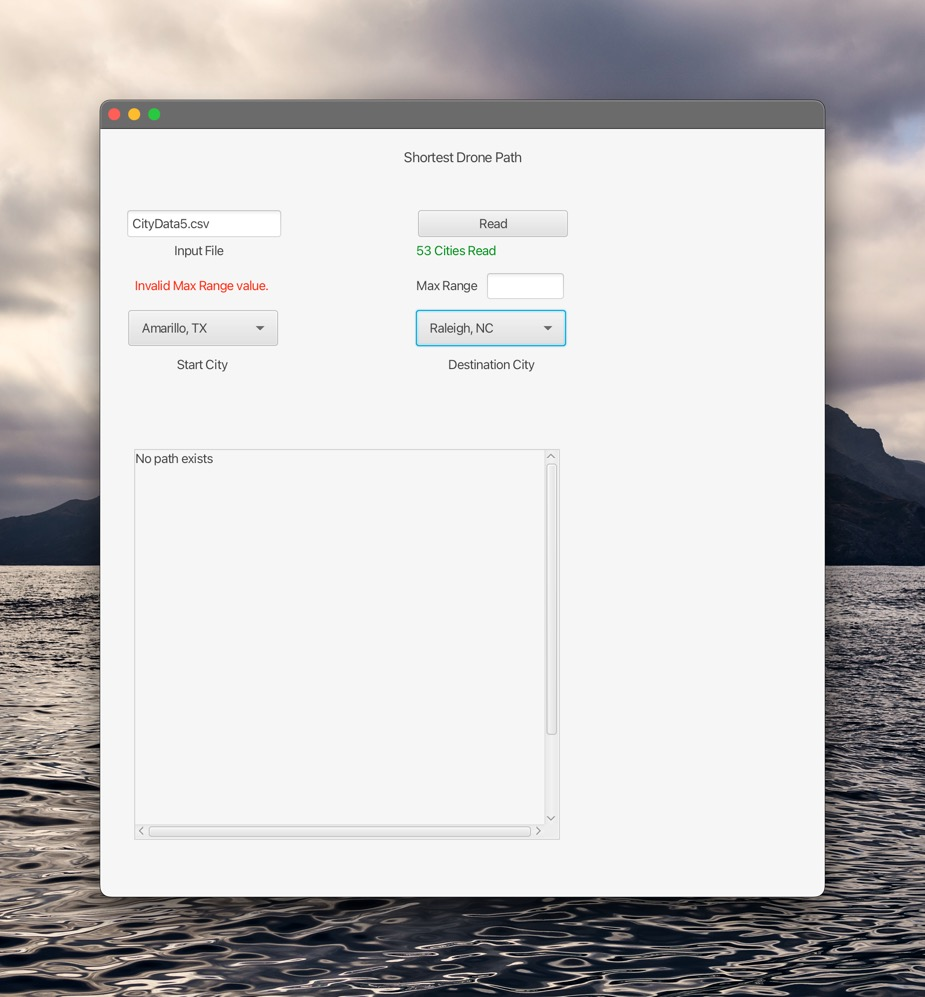
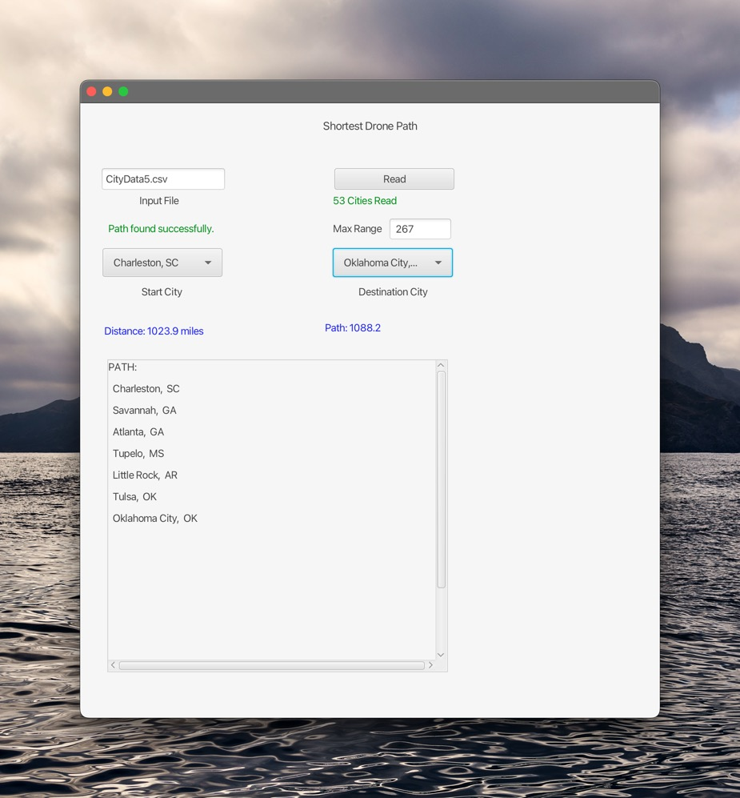
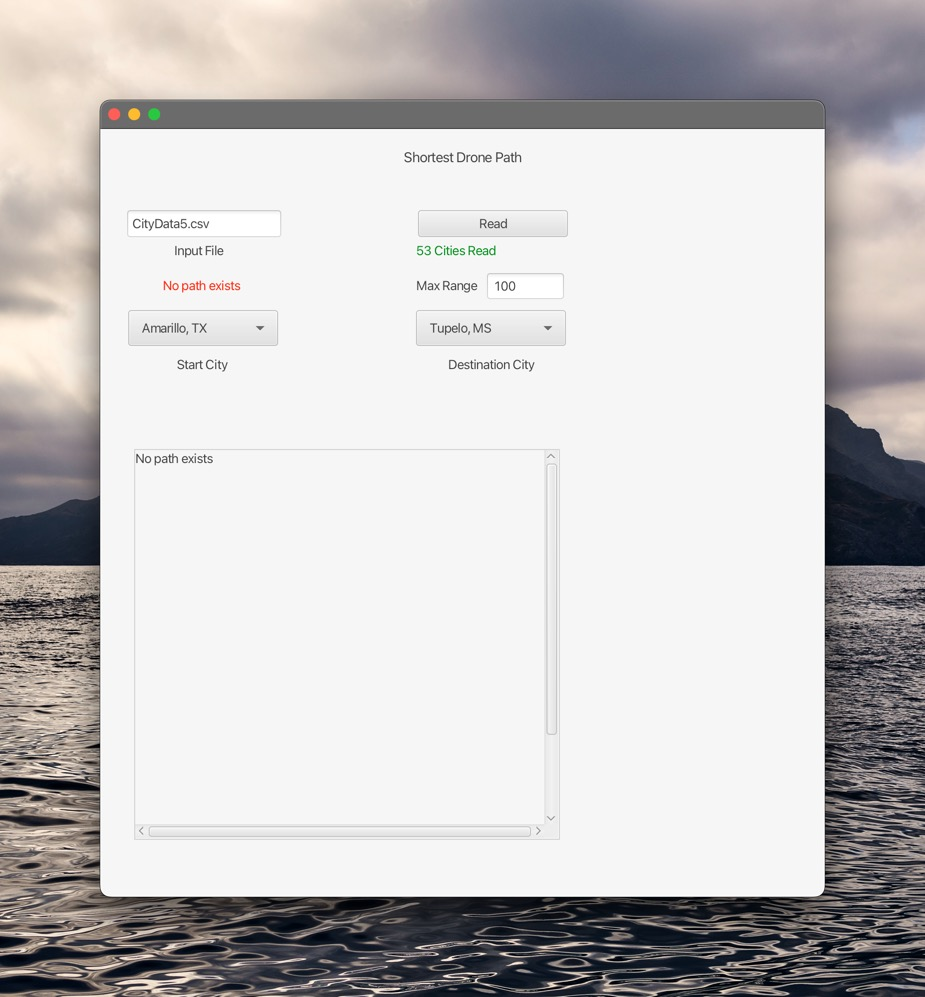

# Shortest Drone Path

A JavaFX desktop application that finds the shortest refueling route for a drone traveling between US cities, built for COSC 2346 class. 

## What It Does

Given a list of 53 US cities and a maximum drone flight range (in miles), the app finds the shortest possible path a drone can take from a start city to a destination city — stopping only at other cities on the list to refuel.

- Reads city data from a CSV file, here is (`CityData5.csv`)
- Builds a weighted graph where cities within range are connected
- Runs **Dijkstra's shortest path algorithm** using a custom **MinHeap priority queue**
- Displays both the direct distance and the total path distance
- Shows the full list of refueling stops along the route

## Screenshot






## How to Run

### Requirements
- Java 17+
- Apache Maven
- NetBeans (recommended) or any Maven-compatible IDE

### Steps
1. Clone the repo:
   ```
   git clone https://github.com/nguyentrac196/shortest-drone-path.git
   ```
2. Open the `Lab05` folder in NetBeans as a Maven project
3. Place `CityData5.csv` in your working directory (included in repo)
4. Click **Run** in NetBeans, or from Terminal:
   ```
   mvn clean javafx:run
   ```
5. In the app:
   - Enter `CityData5.csv` in the Input File field and click **Read**
   - Select a Start City and Destination City
   - The shortest path and distances will display automatically

## How It Works

The problem is modeled as an **undirected weighted graph**:
- Each city is a node
- Two cities are connected by an edge if the distance between them is within the drone's max range
- Edge weights are great-circle distances calculated using the **Haversine formula**
- Dijkstra's algorithm finds the shortest total path between any two cities

If no path exists (cities are too far apart for the given range), the app displays **"No path exists"**.

## Project Structure

```
src/
└── main/
    ├── java/trac/
    │   ├── App.java                  # JavaFX entry point
    │   ├── PrimaryController.java    # GUI logic and event handling
    │   ├── Graph.java                # Graph + Dijkstra's algorithm
    │   ├── MinHeapPriorityQueue.java # Custom generic MinHeap (extra credit)
    │   ├── City.java                 # City data model
    │   ├── Government.java           # Base class for City
    │   └── State.java                # State data model
    └── resources/trac/
        └── primary.fxml              # JavaFX UI layout
```

## Technologies

- Java 17 / JavaFX 22
- Apache Maven
- Dijkstra's Shortest Path Algorithm
- MinHeap Priority Queue (custom generic implementation)
- Haversine / Great-Circle Distance Formula
- CSV file parsing
